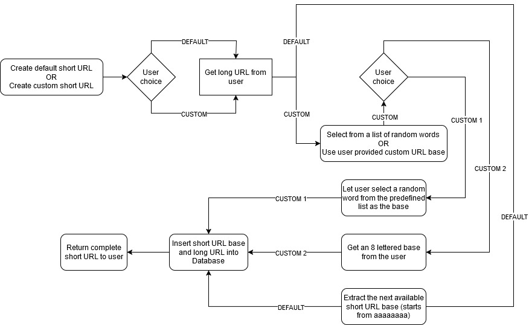

# BlazinglyFast-URL-Shortener-Challenge

Contains the submission made by [A-I-nstein](https://github.com/A-I-nstein) for the "BlazinglyFast URL Shortener Challenge" conducted by [Hackathon Raptors](https://www.raptors.dev/).

* Core function: URL shortening
* Special feature: Custom URL aliases
* Built Using: Rust, Axum and Rusqlite

Click the image below to watch the demo:

Credits: [words_alpha.txt](https://github.com/dwyl/english-words) 